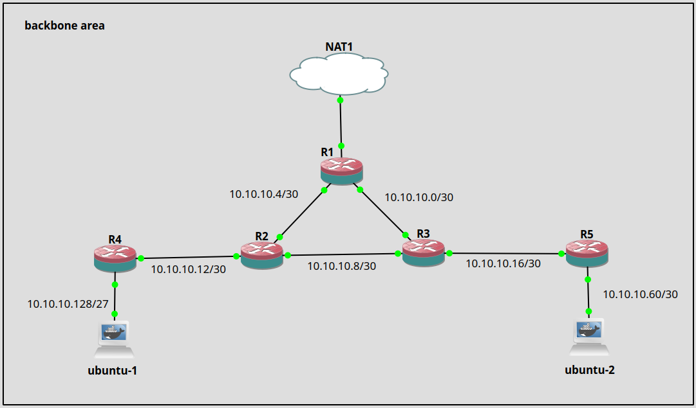

## Topology



Pada topologi ini semua router akan berada terhubung pada backbone area

> Autonomous system boundary router adalah router yang mendistibusikan protokol non OSPF ke area yang menngunakan protokol OSPF
> Router yang berada di backbone area disebut dengan backbone router
> Router yang berada di masing-masing area disebut dengan router internal
> Area border routing adalah router yang menghubungkan antar area

### Role

`Router 1` Sebagai AS Boundary Router

#### Add interface loopback

interface loopback ditambahkan pada setiap router sebagai RID

> Pada OSPF Router ID digunakan untuk mengidentifikasi setiap router

```
/interface bridge
add name=loopback
```

#### Configurasi masing-masing router

`Router 1`

```
/ip address
add address=10.10.10.1/30 interface=ether2 network=10.10.10.0
add address=10.10.10.5/30 interface=ether3 network=10.10.10.4
add address=1.1.1.1 interface=loopback network=1.1.1.1
/ip dhcp-client
add disabled=no interface=ether1
```

Membuat ospf instance dengan **distribute-default=if-installed-as-type-1** karena ini akan melakukan redistribute informasi routing yang berasal dari luar (External Route) AS OSPF. Informasi routing yang akan didistribusikan ini nanti bisa berupa Connected Route, Static Route, maupun Dynamic Routing Protocol yang lain (BGP, RIP, OSPF)

Kemudian mekanisme yang digunakan oleh OSPF untuk melakukan redistribusi routing eksternal ini secara umum ada 2, yaitu:

- E1 atau Redistribute as Type 1 - Perhitungan cost E1 merupakan jumlah dari 'External Metric' dan 'Internal Cost'
- E2 atau Redistribute as Type 2 - Perhitungan cost E2 hanya melihat pada nilai dari 'External Metric'

```
/routing ospf instance
set [ find default=yes ] distribute-default=if-installed-as-type-1 router-id=1.1.1.1
```

Menambahkan daftar network yang akan di advertise

```
/routing ospf network
add area=backbone network=10.10.10.0/30
add area=backbone network=10.10.10.4/30
```

`Router 2`

```
/ip address
add address=10.10.10.6/30 interface=ether2 network=10.10.10.4
add address=10.10.10.9/30 interface=ether1 network=10.10.10.8
add address=10.10.10.13/30 interface=ether3 network=10.10.10.12
add address=1.1.1.2 interface=loopback network=1.1.1.2
```

Membuat instance ospf

```
/routing ospf instance
set [ find default=yes ] redistribute-connected=as-type-1 router-id=1.1.1.2
```

Menambahkan network yang di advertise

```
/routing ospf network
add area=backbone network=10.10.10.8/30
add area=backbone network=10.10.10.4/30
add area=backbone network=10.10.10.12/30
```

`Router 3`

```
/ip address
add address=10.10.10.2/30 interface=ether1 network=10.10.10.0
add address=10.10.10.10/30 interface=ether2 network=10.10.10.8
add address=10.10.10.17/30 interface=ether3 network=10.10.10.16
add address=1.1.1.3 interface=loopback network=1.1.1.3
```

Membuat instance ospf

```
/routing ospf instance
set [ find default=yes ] redistribute-connected=as-type-1 router-id=1.1.1.3
```

Menambahkan network yang di advertise

```
/routing ospf network
add area=backbone network=10.10.10.0/30
add area=backbone network=10.10.10.8/30
add area=backbone network=10.10.10.16/30
```

`Router 4`

```
/ip address
add address=10.10.10.14/30 interface=ether1 network=10.10.10.12
add address=10.10.10.129/27 interface=ether2 network=10.10.10.128
add address=1.1.1.4 interface=loopback network=1.1.1.4
```

Membuat instance ospf

```
/routing ospf instance
set [ find default=yes ] redistribute-connected=as-type-1 router-id=1.1.1.4
```

Menambahkan network yang di advertise

```
/routing ospf network
add area=backbone network=10.10.10.12/30
add area=backbone network=10.10.10.128/27
```

`Router 5`

```
/ip address
add address=10.10.10.18/30 interface=ether1 network=10.10.10.16
add address=10.10.10.161/27 interface=ether2 network=10.10.10.160
add address=1.1.1.5 interface=loopback network=1.1.1.5
```

Membuat instance ospf

```
/routing ospf instance
set [ find default=yes ] redistribute-connected=as-type-1 router-id=1.1.1.5
```

Menambahkan network yang di advertise

```
/routing ospf network
add area=backbone network=10.10.10.16/30
add area=backbone network=10.10.10.160/27
```
