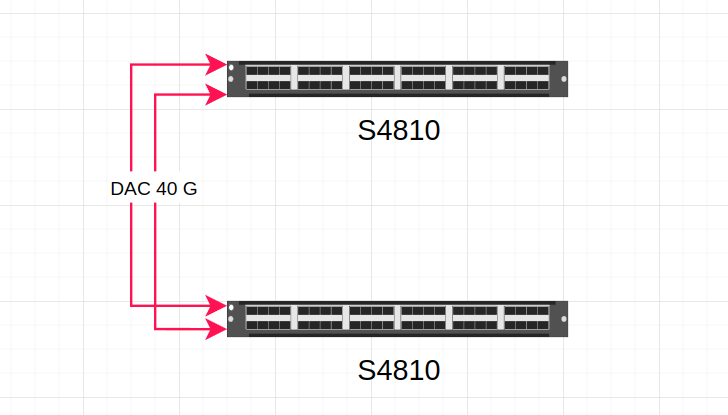
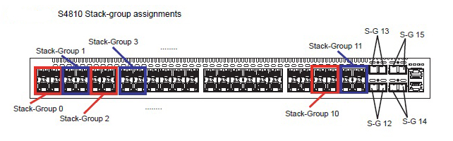

## Ring Topology



Pada topologi ini menggunakan dell switch s4810 switch 1 sebagai master dan switch 2 sebagai slave


Stack Group Id. Kali ini menggunakan 2 kabel yang terhubung SG 14 dan SG 15 pada masing-masing switch

> Sebelum melakukan stacking pada switch pastikan OS yang berjalan sama pada setiap switch
> Stack unit adalah nomor chasis perangkat switch. Default 0.
> Role switch : management( master) dan standby (slave).
> Yang menjadi master adalah stack-unit yang kecil atau memiliki priority yang lebih besar
> Ketika switch management mati (master), maka nanti otomatis yang standby (slave) akan aktif sebagai management
> Ganti hostname = kedua switch punya 1 hostname yang sama
> Remove stacking gak bisa cuman dengan hapus startup-config aja
> Jika port di switch dicabut/dipindah, stackingnya auto menghilang
> Salah satu switch direload, dua-duanya jadi kereload ulang

command verison check

```
#EXEC Privilege mode
show version
show os-version
```

`Switch 2` Sebagai Slave

```
#EXEC Privilege mode

#ganti stack unit sw-2 bernilai 1
stack-unit 0 renumber 1

configure
#atur priority
stack-unit 1 priority 11

#masukan stack group port
stack-unit 1 stack-group 14
stack-unit 1 stack-group 15
exit

write memory
reload

```

`Switch 1` Sebagai Master

```
#EXEC Privilege mode

configure
#atur priority
stack-unit 10 priority 12

#masukan stack group port
stack-unit 0 stack-group 14
stack-unit 0 stack-group 15
exit

write memory
reload
```

Check Configurasi Stacking

```
#EXEC Privilege mode
show system brief
show system stack-ports

```

Remove Stacking

```
#Configure Mode
no stack-unit id stack-group id
do write memory
do reload
```
